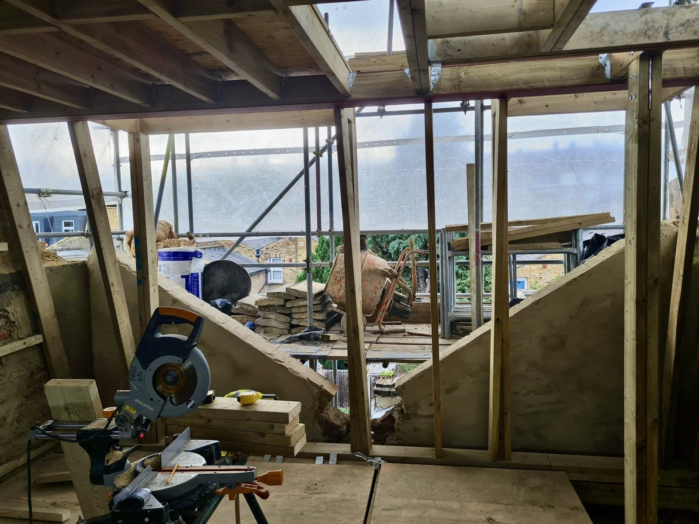

# ATFR Construction Portfolio 🏗️

> This project is a high-end landing page built from the ground up to showcase modern web development practices using HTML, CSS (Sass), and JavaScript.

*(Tip: Replace this with a screenshot.png of the live site in your browser)*

## 🚀 About the Project
ATFR Construction is a professional portfolio designed for a civil engineering and construction firm. The core philosophy of this project was to bypass heavy frameworks (like Bootstrap or Tailwind) in favor of a bespoke solution built with Vanilla JavaScript and Modular Sass (SCSS).

The result is a lightweight, high-performance site with smooth transitions and a fully responsive layout tailored for any device.

## 🛠️ Tech Stack & Architecture
I focused on a "clean code" approach, prioritizing performance and maintainability:

- **Semantic HTML5:** Structured for maximum accessibility (A11Y) and SEO optimization.
- **Sass (SCSS) Architecture:** Implemented a modular folder structure (Base, Layout) to ensure the styles remain scalable and easy to navigate.
- **Vanilla JavaScript:**
  - **Custom Carousel:** A hand-coded slider logic for the services section.
  - **Lightbox Gallery:** A custom-built modal system for viewing project photos.
  - **Scroll Animations:** Used the `IntersectionObserver` API for high-performance reveal effects.
- **Cross-Browser Optimization:** Specific fixes for Safari and iOS, including handling fixed background issues on mobile devices.

## 💡 Technical Challenges & Solutions
Developing this project provided deep insights into professional front-end workflows:

1. **DOM Manipulation:** Building UI components like the Lightbox and Slider from scratch deepened my understanding of how the browser handles events and styles without the abstraction of a library.
2. **Scalable CSS:** Organizing styles by responsibility rather than having a single massive file taught me how to manage large-scale styling projects effectively.
3. **The "iOS Fixed Background" Bug:** Solved the common issue where `background-attachment: fixed` fails on mobile Apple devices by using targeted `@supports (-webkit-touch-callout: none)` queries.
4. **UI/UX Principles:** Focused on visual hierarchy, typography, and micro-interactions to create a premium feel that aligns with the construction industry's standards.

## 🌐 Live Preview
You can check out the live version here:
**[View Project Live](https://guilhermedev25.github.io/atfr-construction/)**
